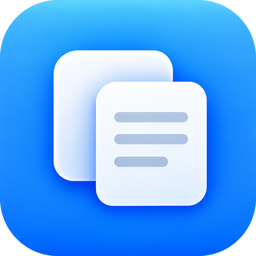
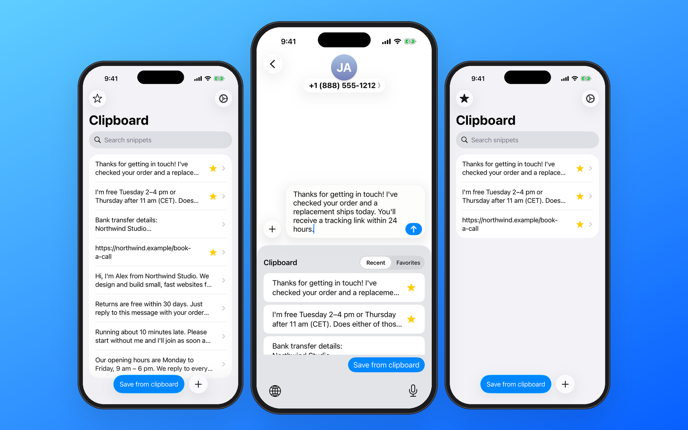
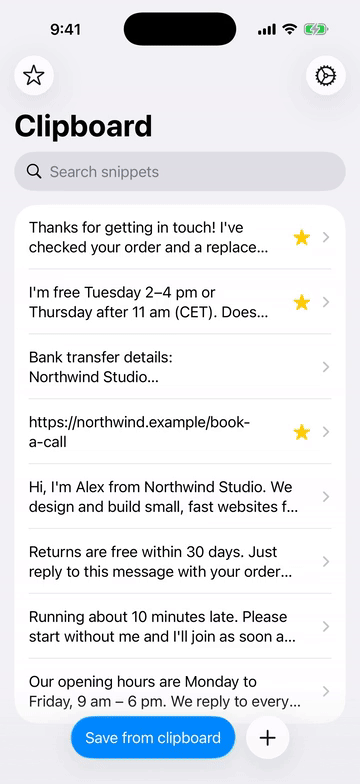
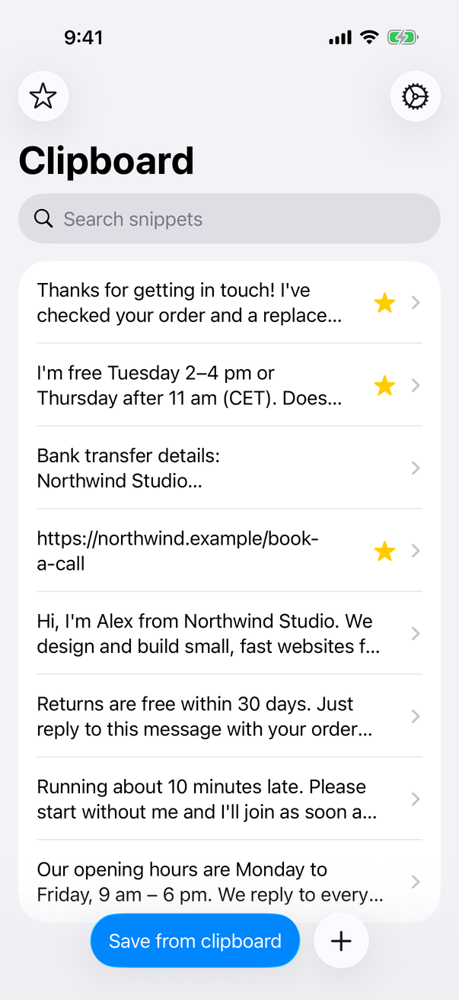
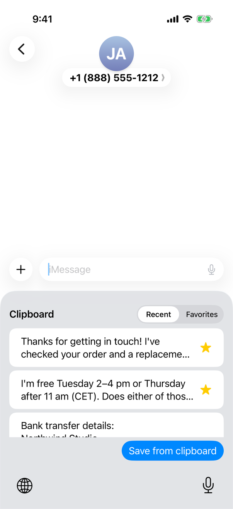
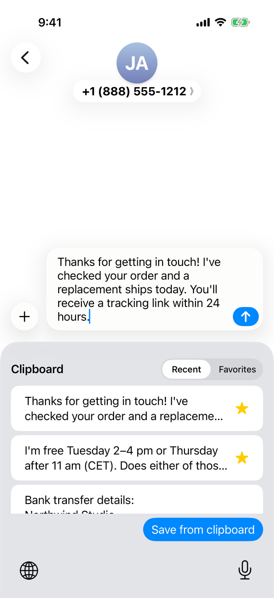
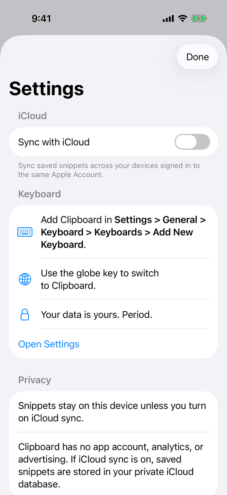
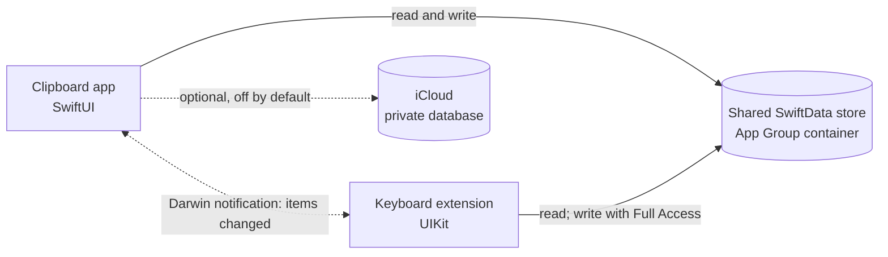

<p align="center">
  
</p>

<h1 align="center">Clipboard</h1>

<p align="center">
  <strong>The text you type again and again, one tap away.</strong>
</p>

<p align="center">
  Save replies, links, and details you reuse often, then insert them into any app from the Clipboard keyboard.
</p>

<p align="center">
  
  
  
  
</p>

<p align="center">
  
</p>

## Features

- **Save text once, reuse it everywhere.** Write snippets in the app, or tap **Save from clipboard** to keep what you just copied.
- **Insert with one tap.** The Clipboard keyboard lists your snippets in any app that accepts text. Tap one to insert its full text at the cursor.
- **Favorites.** Star the snippets you use most. Both the app and the keyboard can show only your favorites.
- **Search.** Find a snippet by any word it contains.
- **Works without Full Access.** The keyboard can always read and insert your snippets. Full Access only adds saving, favoriting, and deleting from the keyboard itself.
- **Optional iCloud sync.** Off by default. When you turn it on, snippets sync through your private iCloud database to your devices signed in to the same Apple Account.
- **Native and accessible.** Built from system components, with support for light and dark mode, Dynamic Type, VoiceOver labels, iPhone and iPad, and English and Spanish.
- **No account, analytics, or ads.**

## See it in action

<p align="center">
  
</p>

<table>
  <tr>
    <td align="center" width="25%"></td>
    <td align="center" width="25%"></td>
    <td align="center" width="25%"></td>
    <td align="center" width="25%"></td>
  </tr>
  <tr>
    <td align="center"><sub>Your library</sub></td>
    <td align="center"><sub>The keyboard, in any app</sub></td>
    <td align="center"><sub>One tap to insert</sub></td>
    <td align="center"><sub>Settings and privacy</sub></td>
  </tr>
</table>

## Getting started

1. **Open Clipboard** and go through the short introduction.
2. **Add a snippet.** Tap **+** to write one, or copy some text and tap **Save from clipboard**.
3. **Enable the keyboard.** Go to **Settings › General › Keyboard › Keyboards › Add New Keyboard** and choose **Clipboard**.
4. **Switch to it.** In any text field, tap or hold the **globe** key and choose **Clipboard**.
5. **Tap a snippet** to insert it. Use the **Recent** and **Favorites** tabs to switch lists.

To save, favorite, or delete snippets from inside the keyboard, turn on **Allow Full Access** for Clipboard in the same Settings screen. You can still manage everything from the app without it.

> [!NOTE]
> iOS always replaces third-party keyboards in password fields and some phone-number fields, and any app can refuse custom keyboards. In those places, the system keyboard appears instead.

## Privacy

A keyboard can see what you type, so this section describes exactly what the code does.

| | |
| --- | --- |
| **What is stored** | The text of each snippet, when it was created, and whether it is a favorite. The app also stores two preferences: whether you finished the introduction and whether iCloud sync is on. |
| **Where it is stored** | A SwiftData (SQLite) database in an App Group container that only the Clipboard app and its keyboard can access. The database is excluded from device backups and uses iOS file protection. |
| **What leaves the device** | Nothing, unless you turn on **Sync with iCloud**. The code makes no network requests of its own. Sync uses Apple's CloudKit and stores snippets in your *private* iCloud database, which the developer cannot read. |
| **What the keyboard reads** | Only your saved snippets. It does not read the text around the cursor. It only inserts the snippet you tap. |
| **Your clipboard** | Read only when you tap **Save from clipboard**, never in the background. iOS may ask for permission to paste. |
| **Full Access** | Optional. Without it, the keyboard opens the database read-only. With it, the keyboard can also save, favorite, and delete snippets. iOS describes Full Access as also allowing network access, but the keyboard contains no networking code and has no iCloud entitlement. |
| **Tracking** | None. The [privacy manifest](PrivacyInfo.xcprivacy) declares no tracking and no collected data. There are no analytics, ads, accounts, or third-party SDKs. |

Things to be aware of:

- **Snippets are not backed up while sync is off.** They are excluded from device backups, so deleting the app or moving to a new device without iCloud sync means losing them.
- **Turning sync off stops future syncing but does not delete copies already in iCloud.**
- **With sync on, the keyboard never talks to iCloud directly.** Changes made from the keyboard reach your other devices the next time the Clipboard app runs.

## Built with

- **Swift** with **SwiftUI** for the app and **UIKit** (`UIInputViewController`) for the keyboard extension
- **SwiftData** for storage, shared through an **App Group**
- **CloudKit** (through SwiftData) for the optional private sync
- **Darwin notifications** so the app and the keyboard refresh each other
- **XCTest** for the storage and UI tests
- A **String Catalog** for English and Spanish

No third-party packages.

## Architecture



Both targets compile the same `Shared/` sources and open the same database file. Each read or write uses a fresh SwiftData context, and a file lock ensures only one process writes at a time. After a write, a Darwin notification tells the other process to reload. Only the app ever opens a CloudKit-backed container.

| Path | Contents |
| --- | --- |
| `ClipboardApp/` | The containing app: snippet list, editor, settings, and onboarding |
| `ClipboardKeyboard/` | The custom keyboard extension (`KeyboardViewController`) |
| `Shared/` | The `ClipboardItem` model, `ClipboardStore` (SwiftData storage), and App Group constants |
| `Resources/` | App icon and the English and Spanish String Catalog |
| `Tests/` | Storage unit tests |
| `UITests/` | End-to-end UI tests, including the real keyboard in the Simulator |
| `docs/APPLE_APIS.md` | The Apple APIs used, their minimum iOS versions, and fallbacks |

## Building from source

**Requirements**

- A Mac with **Xcode 26.3** (the version the project is developed with; older versions are untested)
- **iOS 17.0** or later, on iPhone or iPad
- No package dependencies to install

**Run in the Simulator.** No Apple Developer account is needed:

```sh
git clone https://github.com/kecoma1/ios-clipboard.git
cd ios-clipboard
open iOSClipboard.xcodeproj
```

Select the **Clipboard** scheme and an iPhone simulator, then run. To use the keyboard in the Simulator, enable it in the Simulator's Settings app the same way as on a device.

**Run on a device.** Code signing needs a few changes in **Signing & Capabilities**, for both the **Clipboard** and **ClipboardKeyboard** targets:

1. Select your own team. The project currently points to the original author's team.
2. Replace the bundle identifiers if needed. The defaults are `com.iosclipboard.app` for the app and `com.iosclipboard.app.keyboard` for the keyboard.
3. Register an App Group and enable it on both targets. The default is `group.com.iosclipboard.shared`.
4. If you change the App Group or iCloud container identifiers, update them in both `.entitlements` files and in `Shared/Constants/AppGroup.swift`.

**iCloud sync (optional).** Only the app target uses iCloud:

1. Create the CloudKit container `iCloud.com.iosclipboard.app`, or your own, and enable iCloud (CloudKit), Push Notifications, and Background Modes › Remote notifications on the app target.
2. Initialize the development schema once. Run a signed Debug build with the `-InitializeCloudKitSchema` launch argument, which is already in the scheme but disabled, while signed in to iCloud.
3. Deploy the schema to production in the CloudKit Console before distributing a build.

Without these steps, the app still builds and works locally, but iCloud sync won't work.

## Testing

The **Clipboard** scheme includes two test targets:

- **`ClipboardStoreTests`** (16 unit tests) covers storage: exact Unicode and multiline text, ordering, favorites, deduplication, concurrent writers, read-only access, backup and file-protection attributes, damaged data, and import from the previous JSON format.
- **`ClipboardUITests`** drives the app, the system Settings app, and the real keyboard in the Simulator, with and without Full Access, in English and Spanish.

Run the unit tests from the command line:

```sh
xcodebuild test -project iOSClipboard.xcodeproj -scheme Clipboard \
  -destination 'platform=iOS Simulator,name=iPhone 17 Pro' \
  -only-testing:ClipboardStoreTests \
  CODE_SIGN_IDENTITY=-
```

Ad-hoc signing (`CODE_SIGN_IDENTITY=-`) gives the simulator build its App Group entitlement without a developer account. Drop `-only-testing` to run the UI tests too. They take several minutes and change the Simulator's keyboard settings, so use a simulator you don't mind resetting.

## Contributing

Bug reports and pull requests are welcome.

- **Report a bug** by [opening an issue](https://github.com/kecoma1/ios-clipboard/issues). Include your iOS version, device, the app you were typing in, and the steps to reproduce it. Never paste real clipboard content.
- **Propose a larger change** in an issue first, so the design can be discussed before you write code.
- **Submit a pull request** that is focused on one change, keeps to the existing style, and passes the unit tests. If you change anything the keyboard can reach, update the Privacy section above.

## License

This project doesn't have a license yet.
